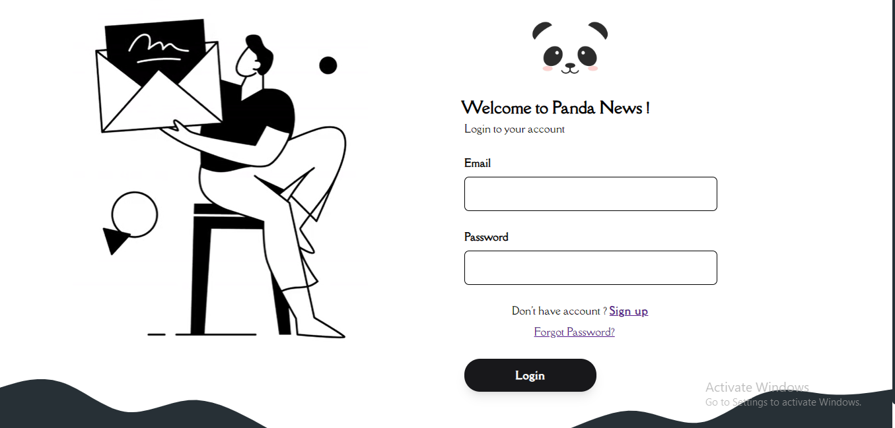
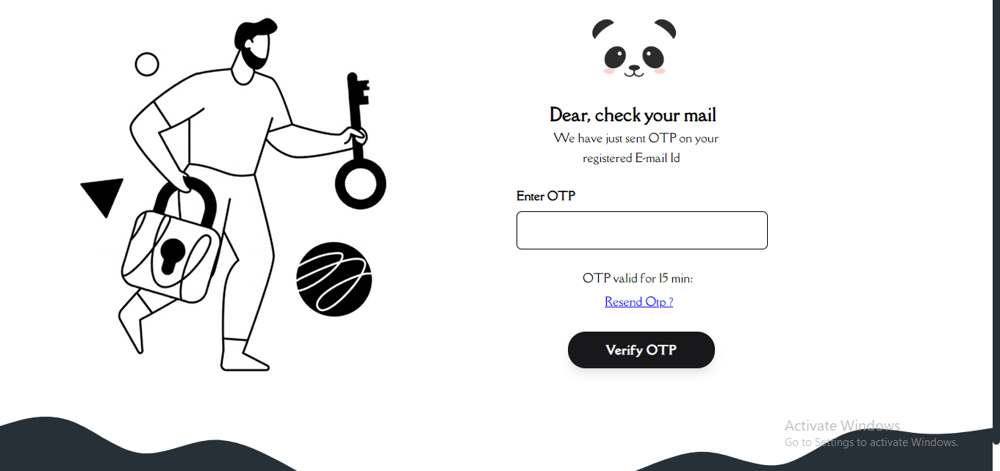
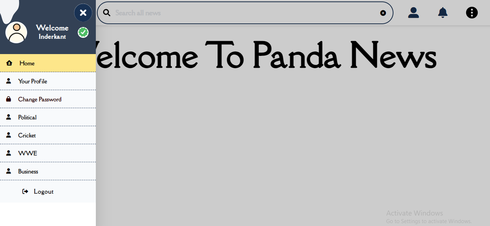
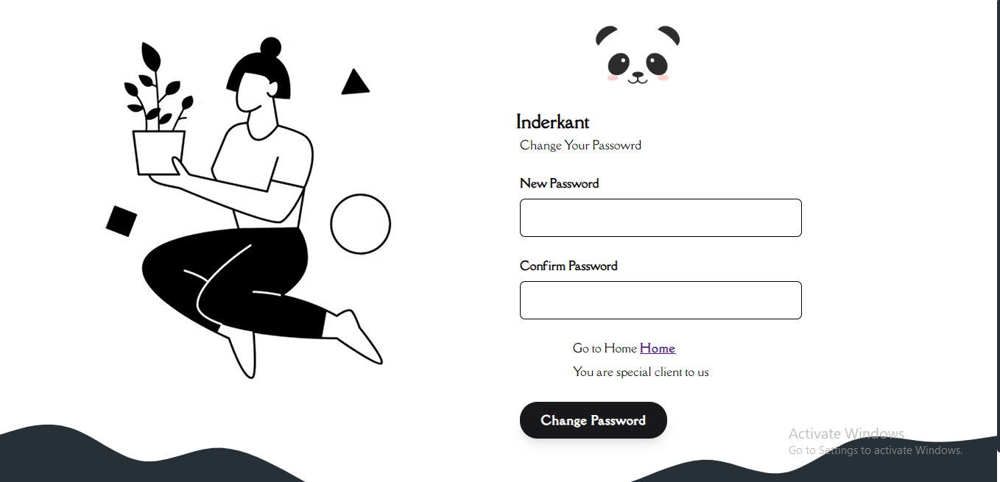
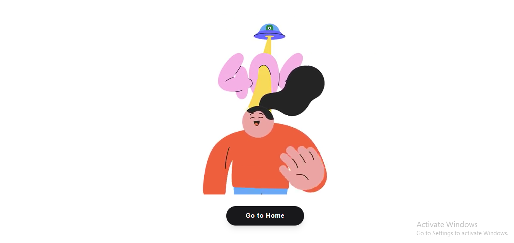
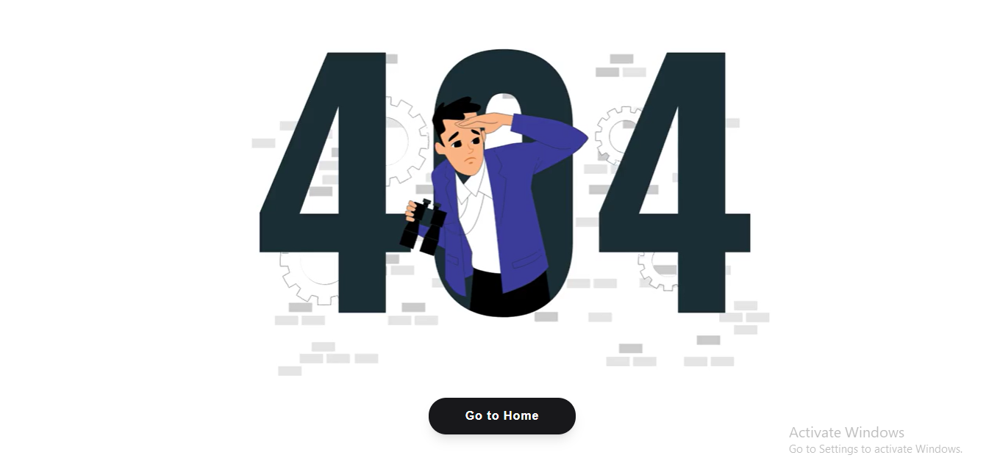

# **Complete Node Express.js Mongodb Auth by `Inderkant`**
## Below are the `Screen shot of` ** Project **
# ** `Login Page` **

# ** `Sign Up Page` **

# ** `Forgot Password Link Sending Page` **

# ** `Reset Password Page` **

# ** `OTP Page` **

# ** `Home Page` **

# ** `Home Page Sidebar` **

# ** `Change Password Page` **

# ** `404 Page When User is Logged Page` **

# ** `404 Page When User is Not Logged Page` **

